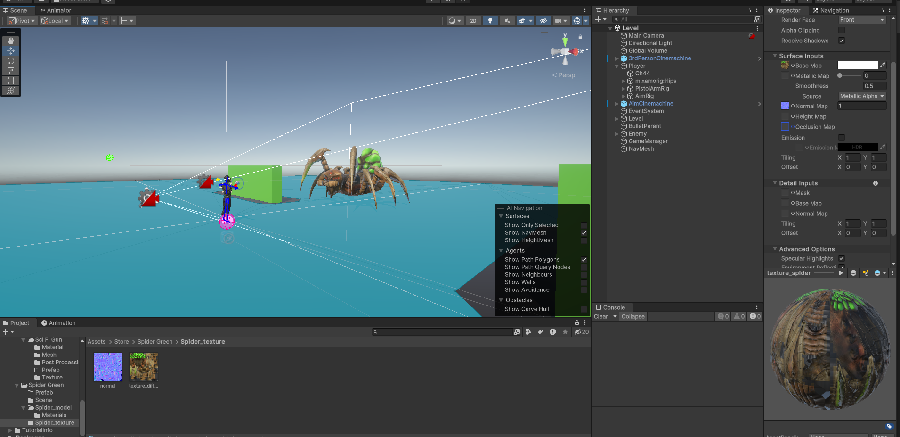
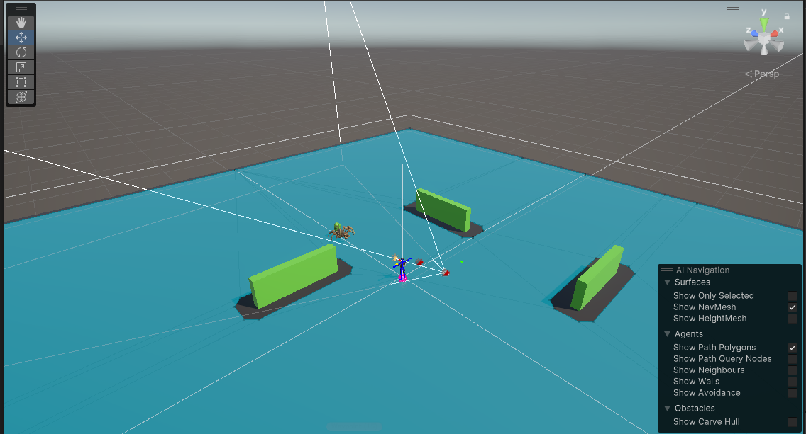
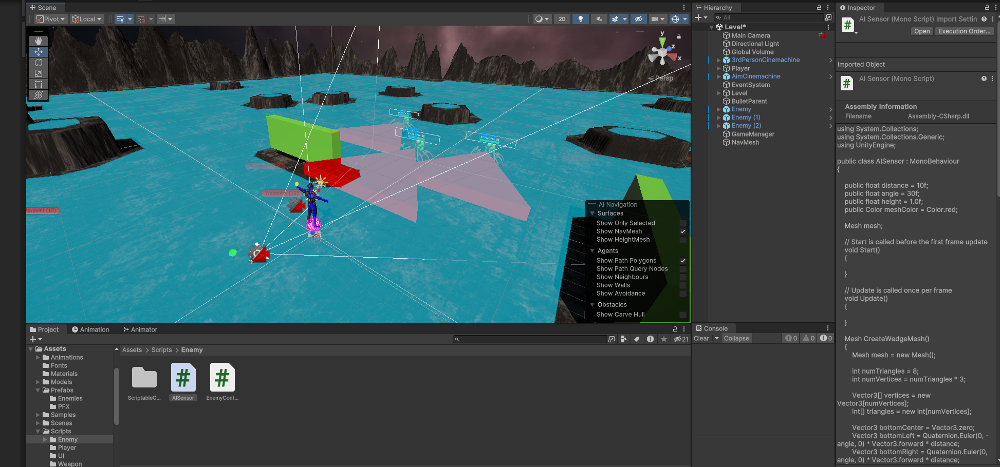
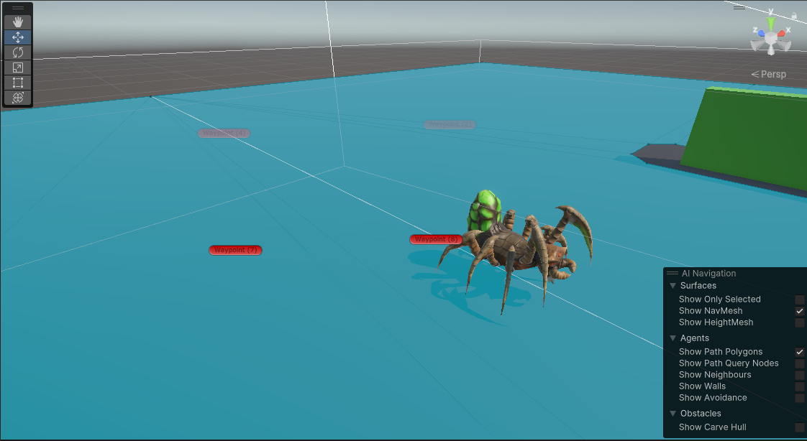

# Project-Arachnid
New 3rd person prototype with enemy AI (scriptable objects &amp; state machines). #MadeWithUnity

Enemy AI detects Player via two methods - Radius (now commented out in the script) and line of sight (field of view detection) which seemed a more realistic way of detection.

A baked NavMesh has been implemented to match the size of the spider meshes by width and the line of sight to the player is broken through walls. 

Each enemy is a scriptable object which allows creation of new types of enemies further down the line. The attributes are fed into the enemy canvas to display the name and health levels.

A dedicated animation state machine aligns with the 4 main states of the AI controller script - patrolling (walking), chasing (running), attacking & death.

Patrolling is determined by an array of waypoints in which a random array index will determine the AI NavAgent's next destination.

Line of sight detection FOV gizmos.

Array of waypoints laid out across the level.

<a href="https://github.com/nhdigital/Project-Arachnid/raw/main/Docs/RadiusVideo.mp4" target=_blank>Play Radius Video</a>

<a href="https://github.com/nhdigital/Project-Arachnid/raw/main/Docs/AttackVideo.mp4" target=_blank>Play Attack Video</a>
